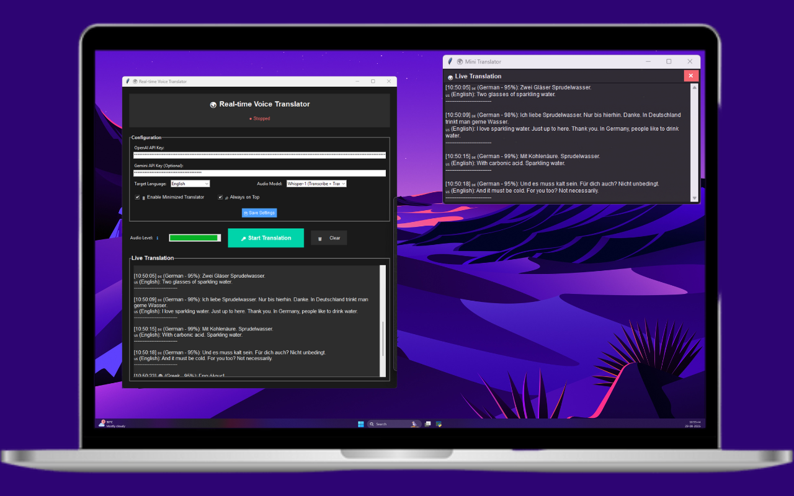

# Real-time Voice Translator

A Python GUI application that provides real-time voice translation during calls. Perfect for understanding Thai, Indonesian, or any other language in real-time.



*Modern dark-themed interface with real-time translation capabilities*

## Features

- 🎤 **Real-time Audio Capture**: Continuously monitors audio input (5-second intervals)
- 🌍 **Multi-language Translation**: Supports translation from any language to English (or other target languages)
- 🤖 **Multiple AI Models**: Choose from GPT-4o Audio, Whisper-1, and Gemini models
- 📱 **Modern GUI**: Clean, dark-themed interface with custom icon and professional styling
- ⚡ **Live Updates**: Translations appear instantly with timestamps
- 🔊 **Audio Level Monitoring**: Visual feedback of audio input levels
- 📌 **Always on Top**: Window stays visible during calls
- 🗑️ **Clear Function**: Easy-to-use clear button for translations
- 📱 **Mini Translator**: Optional compact floating window for minimal screen usage

## Installation

### 1. Install Python Dependencies

```bash
pip install -r requirements.txt
```

### 2. Install PyAudio (Windows)

For Windows, you might need to install PyAudio separately:

```bash
pip install pipwin
pipwin install pyaudio
```

Or download the appropriate wheel file from: https://www.lfd.uci.edu/~gohlke/pythonlibs/#pyaudio

### 3. Get API Keys

**OpenAI API Key:**
1. Go to https://platform.openai.com/api-keys
2. Create a new API key
3. Copy the key for use in the application

**Gemini API Key (Optional):**
1. Go to https://makersuite.google.com/app/apikey
2. Create a new API key
3. Copy the key for use in the application

## Usage

### 1. Run the Application

```bash
python realtime_voice_translator.py
```

### 2. Configure Settings

1. Enter your OpenAI API key in the configuration section
2. (Optional) Enter your Gemini API key for Google's models
3. Select your target language (default: English)
4. Choose your preferred audio model:
   - **GPT-4o Audio Preview**: Best quality, direct audio processing (OpenAI)
   - **Whisper-1**: Fast transcription + translation (cost-effective, OpenAI)
   - **Gemini 1.5 Flash**: Fast and efficient (Google)
   - **Gemini 1.5 Pro**: High quality (Google)
5. Click "💾 Save Settings"

### 3. Start Translation

1. Click "🎤 Start Translation" (button will change to "⏹️ Stop Translation")
2. The application will start monitoring your microphone every 5 seconds
3. Speak or have others speak in Thai, Indonesian, or any language
4. Translations will appear in real-time in the text area
5. Click the same button again to stop translation

### 4. During Calls

- Keep the application window open and visible
- The "Always on Top" feature ensures it stays visible
- Audio level bar shows current input levels
- Translations appear with timestamps

## Configuration

The application creates a `translator_config.json` file with these settings:

- `openai_api_key`: Your OpenAI API key
- `source_language`: Source language detection (auto-detect)
- `target_language`: Target language for translation
- `audio_threshold`: Minimum audio level to process (reduces noise)
- `translation_model`: OpenAI model to use
- `selected_audio_model`: Currently selected audio processing model

## Troubleshooting

### Audio Issues

1. **No audio detected**: Check microphone permissions and ensure your microphone is working
2. **Poor quality**: Adjust the `audio_threshold` in config file
3. **Latency**: The app processes audio every 3 seconds for better accuracy

### API Issues

1. **Invalid API key**: Verify your OpenAI API key is correct
2. **Rate limits**: OpenAI has usage limits - check your account
3. **Model access**: Ensure you have access to GPT-4o-audio-preview

### Performance

- The app keeps only the last 50 translations to prevent memory issues
- Audio processing runs in background threads for smooth performance
- GUI updates are optimized for real-time display

## Tips for Best Results

1. **Clear Audio**: Ensure good microphone quality and minimal background noise
2. **Stable Internet**: Translation requires internet connection to OpenAI
3. **Proper Positioning**: Keep the app window visible but not blocking your call interface
4. **Language Detection**: The app auto-detects source language, works best with clear speech
5. **Model Selection**: Use Whisper-1 for cost-effective transcription, GPT-4o Audio for best quality
6. **5-Second Intervals**: The app processes audio every 5 seconds for complete sentences

## Supported Languages

The app can translate FROM any language TO:
- English (default)
- Nepali
- Hindi
- Spanish
- French
- German
- Chinese
- Japanese

You can modify the target language list in the code to add more languages.
